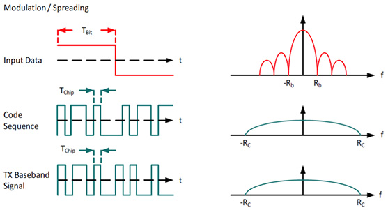
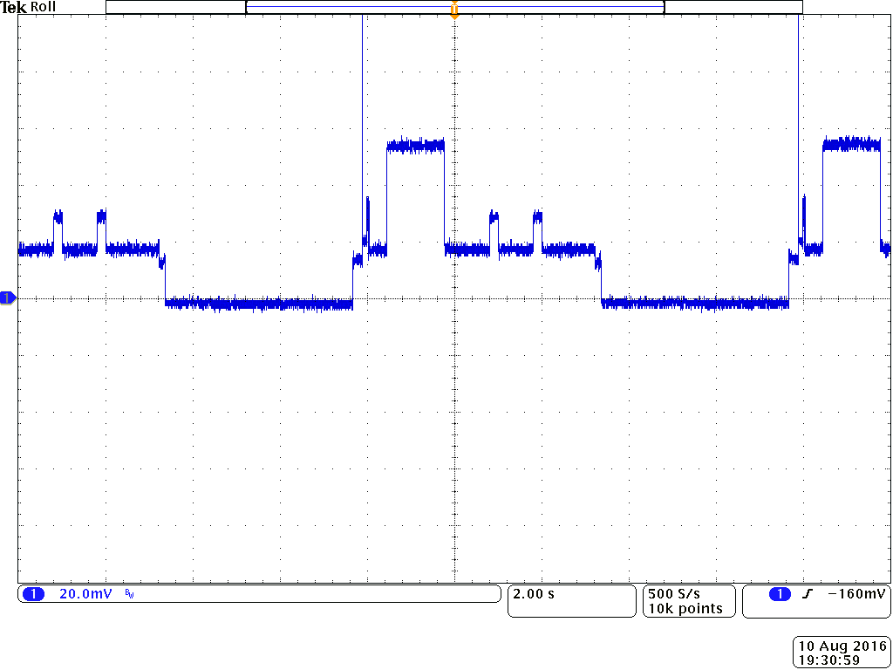
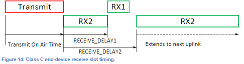

class: center, middle

# LoRaWAN with RIOT

---

## Overview of LoRaWAN

 

- Designed by Semtech and promoted by the LoRa Alliance

 
.center[
    
    
]

 

- First release 1.0 of the LoRaWaN specification in 2015

- Latest release 1.1 in 2018

- Based on long range radio communication modulation, LoRa

- Star network topology &#x21d2; devices talks to the network via gateways

---

## A few words on LoRa

<table style="width:100%;margin-top:-40px">
<tr>
  <td><ul>
  <li>Long range radio technology  </li>
  <li>Spread Spectrum modulation:   &#x21d2; "Chirp Spread Spectrum"  </li>
  <li>Very robust to noise, multipath and Doppler effect</li>
  </ul></td>
  <td>.center[
       
      
    ]
</tr>
<tr>
  <td><ul>
        <li>Raising the spreading factor:
          
            <ul>
                <li>increases the range (until several kilometers)</li>
                <li>increases the time on air</li>
                <li>increases energy consumption</li>
            </ul>
        </li>
    </ul>
  </td>
  <td></td>
</tr>
</table>

---

## The LoRaWAN protocol

.center[ ]

 

- Different frequency bands depending on the geographical regions

- Use LoRa modulation

- 3 device classes &#x21d2; A, B & C

- The application layer is directly on top of the MAC layer

---

## Access to the physical layer

.center[
    
]

 

- Public and free **ISM bands** used: EU868 (ETSI), US915, etc

- Bands are divided into **channels** of 3 different widths: 125kHz, 250kHz ou 500kHz

- Time constrained access to the physical layer &#x21d2; **Duty Cycle** (1% / channel)

- Example: at least 16 channels can be used in EU868 band

---

## Class A & C devices

<table style="width:100%">
<tr>
  <td><b>Class A device</b>
  <ul>
  <li>Can only receive after a send</li>
  <li>Smallest power consumption</li>
  <li>Can be used on battery</li>
  </ul>
  
  </td>
  <td> 
  .center[ 
Power consumption of a class A device]</td>
</tr>
</table>

<table style="width:100%">
<tr>
  <td><b>Class C device</b>
  <ul>
  <li>Always listening: low latency</li>
  <li>More power consumption</li>
  <li>Cannot be used on battery</li>
  </ul>
  </td>
  <td> </td>
</tr>
<table>

---

## LoRaWAN network architecture

.center[
     
]

- **Devices and gateways** exchange messages using LoRa communications

- **Gateway** are connected to the network server via regular Internet protocols

- Users access their data via an application connected to the network server

- Security of the data is garantueed by **AES** encryption (symmetric keys)

---

## Device communication on the network

.center[
     
]

 

- Every device is identified by a 4 bytes address

- "Network session key" &#x21d2; used to encrypt the network related data (MAC)

- "Application session key" &#x21d2; used to encrypt the application related data

---

## Activation procedures

.center[To exchange data, all devices must be activated by the network]

&#x21d2; 2 type of activation procedures:

- Over-The-Air Activation(OTAA)

- Activation By Personnalization (ABP)

.center[
     
]

---

## Activation procedures

- in **OTAA**:
  - Requires Device EUI, Application EUI and Application Key information

  - The device initiates a handshake with the server to get its address and
    a "nonce" &#x21d2; the device address changes after each activation

  - The 2 session keys are derived from the application key and the nonce

- in **ABP**

  - Requires Application session key, Network session key and device address

  - No handshake required

---

## TheThingsNetwork (TTN)

- The network deployment is **community based**

- Software stack is open-source

.center[
     
]

- Unlimited access to the backend

  - no device limit

  - no message limit (with respect to the duty-cycle)

  - friendly API (MQTT)

---

## First steps with TTN: practice

1. Create an account 
  https://account.thethingsnetwork.org/register

  Manage your gateways and application from your web console: https://console.thethingsnetwork.org/

2. Managing your gateways (optional) 
  https://www.thethingsnetwork.org/docs/gateways/registration.html

3. Add a new application 
  https://console.thethingsnetwork.org/applications

4. Register your device in your application 
  https://console.thethingsnetwork.org/applications/yourapplication

---

## Test TTN with RIOT: practice

.center[
<form class=notebook>
    <input class=login id="login_ttn_getting_started" type="text" oninput="check_login('login_ttn_getting_started', 'launcher_ttn_getting_started')" placeholder="Enter your IoT-LAB login">
    <input class=launcher id="launcher_ttn_getting_started" type="button" value="Launch notebook" onclick="open_notebook('login_ttn_getting_started', 'riot/lorawan/ttn-getting-started/ttn-getting-started.ipynb')" disabled>
</form>
]

---

## Exercise: Send sensor data to TTN

.center[
<form class=notebook>
    <input class=login id="login_ttn_sensors" type="text" oninput="check_login('login_ttn_sensors', 'launcher_ttn_sensors')" placeholder="Enter your IoT-LAB login">
    <input class=launcher id="launcher_ttn_sensors" type="button" value="Launch notebook" onclick="open_notebook('login_ttn_sensors', 'riot/lorawan/ttn-sensors/ttn-sensors.ipynb')" disabled>
</form>
]

---

## Integration with external services

- Use of TTN http and/or MQTT API to retrieve the IoT data

- Super simple to integrate

- Available services:

  - Customizable dashboards with Cayenne 
    https://mydevices.com/

  - Location service with Collos 
    http://preview.collos.org/

  - Gather and analyze workspace use and sensors with OpenSensors 
    https://opensensors.com/

  - Just store your IoT data with TheThingsIndustries 
    https://www.thethingsindustries.com/

---

## An example: Cayenne

https://mydevices.com/cayenne/docs/lora/#lora-the-things-network

- Create only dashboards in a few clicks from your LoRaWAN data

- Access your sensor data from anywhere

- Payload format requirement: Low Power Payload (LPP)

  - Library available for python/micropython: 
  https://github.com/jojo-/py-cayenne-lpp

  - Library available for Arduino (C++): 
  https://github.com/sabas1080/CayenneLPP

  - Generic library in C 
  https://github.com/riot-os/cayenne-lpp

---

## Exercise: Integration with Cayenne LPP

.center[
<form class=notebook>
    <input class=login id="login_ttn_cayenne_lpp" type="text" oninput="check_login('login_ttn_cayenne_lpp', 'launcher_ttn_cayenne_lpp')" placeholder="Enter your IoT-LAB login">
    <input class=launcher id="launcher_ttn_cayenne_lpp" type="button" value="Launch notebook" onclick="open_notebook('login_ttn_cayenne_lpp', 'riot/lorawan/ttn-cayenne-lpp/ttn-cayenne-lpp.ipynb')" disabled>
</form>
]

---

class: center, middle

## All complete ? Well done!
