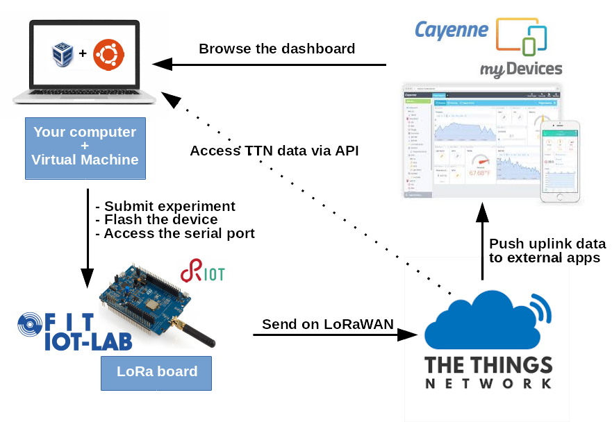

class: center, middle

# LoRaWAN with RIOT

---

## Objective of the tutorial

1. Learn the basics of LoRaWAN networks and use TheThingsNetwork provider

  .right[
      
  ]

2. Write a LoRaWAN application based on RIOT

  .right[
      
  ]

3. Publish sensor data to a Web dashboard

---

## Tutorial overview (1)

.center[
    
]

---

## The LoRaWAN protocol

.center[ ]

 

- Different frequency bands depending on the geographical regions

- Use LoRa modulation

- 3 device classes &#x21d2; A, B & C

- The application layer is directly on top of the MAC layer

---

## Access to the physical layer

.center[
    
]

 

- Public and free **ISM bands** used: EU868 (ETSI), US915, etc

- Bands are divided into **channels** of 3 different widths: 125kHz, 250kHz ou 500kHz

- Time constrained access to the physical layer &#x21d2; **Duty Cycle** (1% / channel)

- Example: at least 16 channels can be used in EU868 band

---

## LoRaWAN network architecture

.center[
     
]

- **Devices and gateways** exchange messages using LoRa communications

- **Gateway** are connected to the network server via regular Internet protocols

- Users access their data via an application connected to the network server

- Security of the data is garantueed by **AES** encryption (symmetric keys)

---

## Device communication on the network

.center[
     
]

 

- Every device is identified by a 4 bytes address

- "Network session key" &#x21d2; used to encrypt the network related data (MAC)

- "Application session key" &#x21d2; used to encrypt the application related data

---

## Activation procedures

.center[To exchange data, all devices must be activated by the network]

&#x21d2; 2 type of activation procedures:

- Over-The-Air Activation(OTAA)

- Activation By Personnalization (ABP)

.center[
     
]

---

## Activation procedures

- in **OTAA**:
  - Requires Device EUI, Application EUI and Application Key information

  - The device initiates a handshake with the server to get its address and
    a "nonce" &#x21d2; the device address changes after each activation

  - The 2 session keys are derived from the application key and the nonce

- in **ABP**

  - Requires Application session key, Network session key and device address

  - No handshake required

---

## TheThingsNetwork (TTN)

- **Community based** LoRaWAN provider

.center[
     
]

- Unlimited access to the backend

  - no device limit

  - no message limit (with respect to the duty-cycle)

  - friendly API (MQTT)

---

## Test TTN with RIOT: practice

Setup a TTN account and connect a LoRa device from IoT-LAB to TTN

.center[
<form class=notebook>
    <input class=login id="login_ttn_getting_started" type="text" oninput="check_login('login_ttn_getting_started', 'launcher_ttn_getting_started')" placeholder="Enter your IoT-LAB login">
    <input class=launcher id="launcher_ttn_getting_started" type="button" value="Launch notebook" onclick="open_notebook('login_ttn_getting_started', 'riot/lorawan/ttn-getting-started/ttn-getting-started.ipynb')" disabled>
</form>
]

---

## Exercise: Send sensor data to TTN

Write a simple LoRaWAN application based on RIOT and send data to TTN

.center[
<form class=notebook>
    <input class=login id="login_ttn_sensors" type="text" oninput="check_login('login_ttn_sensors', 'launcher_ttn_sensors')" placeholder="Enter your IoT-LAB login">
    <input class=launcher id="launcher_ttn_sensors" type="button" value="Launch notebook" onclick="open_notebook('login_ttn_sensors', 'riot/lorawan/ttn-sensors/ttn-sensors.ipynb')" disabled>
</form>
]

---

## Exercise: Integration with Cayenne LPP

Integrate your application with MyDevices Cayenne to publish the data on a web dashboard!

.center[
<form class=notebook>
    <input class=login id="login_ttn_cayenne_lpp" type="text" oninput="check_login('login_ttn_cayenne_lpp', 'launcher_ttn_cayenne_lpp')" placeholder="Enter your IoT-LAB login">
    <input class=launcher id="launcher_ttn_cayenne_lpp" type="button" value="Launch notebook" onclick="open_notebook('login_ttn_cayenne_lpp', 'riot/lorawan/ttn-cayenne-lpp/ttn-cayenne-lpp.ipynb')" disabled>
</form>
]

---

class: center, middle

## All complete ? Well done!
