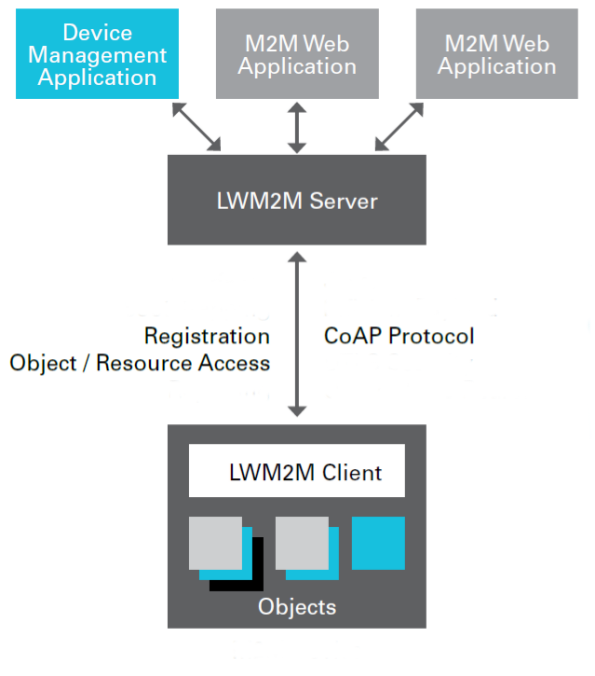

class: center, middle

# From 802.15.4 radio to LwM2M server

---

## Overview of the tutorial

1. Discover the 802.15.4 radio

2. Learn how to setup a public IPv6 network with an IoT-LAB M3 node

3. Register a IoT-LAB M3 node with a Leshan server using LwM2M

 
.center[ ]

---

## Exercise: Basic 802.15.4 radio manipulations

.center[
<form class=notebook>
    <input class=login id="login_802154" type="text" oninput="check_login('login_802154', 'launcher_802154')" placeholder="Enter your IoT-LAB login">
    <input class=launcher id="launcher_802154" type="button" value="Launch notebook" onclick="open_notebook('login_802154', 'riot/networking/802.15.4/udp.ipynb')" disabled>
</form>
]

---

## Exercise: IPv6 networking

Learn how to setup a public IPv6 network on an IoT-LAB node

.center[
<form class=notebook>
    <input class=login id="login_ipv6" type="text" oninput="check_login('login_ipv6', 'launcher_ipv6')" placeholder="Enter your IoT-LAB login">
    <input class=launcher id="launcher_ipv6" type="button" value="Launch notebook" onclick="open_notebook('login_ipv6', 'riot/networking/ipv6/ipv6.ipynb')" disabled>
</form>
]

---

## Exercise: communication with a LwM2M server

Interact with a Leshan server using LwM2M

.center[
<form class=notebook>
    <input class=login id="login_lwm2m" type="text" oninput="check_login('login_lwm2m', 'launcher_lwm2m')" placeholder="Enter your IoT-LAB login">
    <input class=launcher id="launcher_lwm2m" type="button" value="Launch notebook" onclick="open_notebook('login_lwm2m', 'riot/networking/lwm2m/lwm2m.ipynb')" disabled>
</form>
]

---

class: center, middle

## All complete ? Well done!
