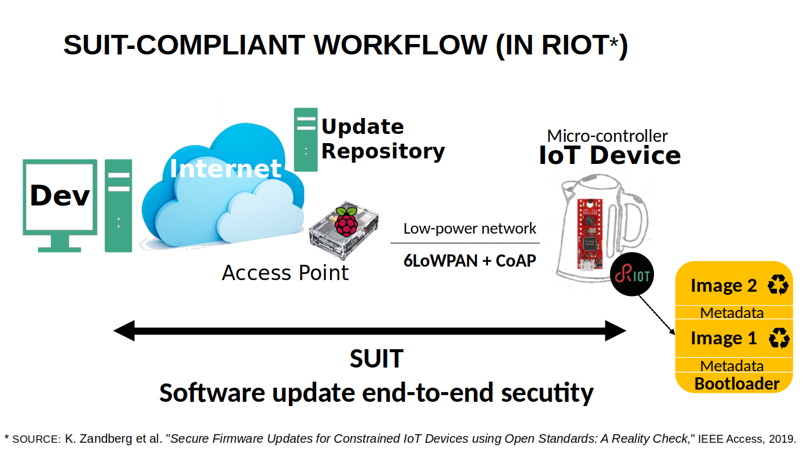

class: center, middle

# IoT Security with Microcontrollers

---

## Goals of the Tutorial (1)

1. Get some basics of security on IoT devices based on micro-controllers

  .right[
      
  ]

2. Hands-on activities: building blocks for secure IoT firmware update over the network

---

## Goals of the Tutorial (2)

1. Exercise 1: compute hashes using SHA256 and SHA3-256

2. Exercise 2: sign and verify signature using ed25519

3. Exercise 3: encrypt and decrypt a message using AES128 (CTR Mode)

4. Exercise 4: secure firmware update over the network with SUIT and CoAP

.center[
    
]

---

## Exercise: Compute a Hash with SHA-256 and SHA3-256

- Some configurations of SHA-3 and SHA-2 are typically used on low-power IoT devices.

.center[
<form class=notebook>
    <input class=login id="login_hash" type="text" oninput="check_login('login_hash', 'launcher_hash')" placeholder="Enter your IoT-LAB login">
    <input class=launcher id="launcher_hash" type="button" value="Launch notebook" onclick="open_notebook('login_hash', 'riot/security/hash/hash.ipynb')" disabled>
</form>
]

---

## Exercise: Sign / Verify a Digital Signature with ed25519

- Elliptic Curve Crypto is preferred on low-end IoT devices. 

- A popular solution here is the Edwards curve Digital Signature Algorithm (EdDSA), a variant of the
Schnorr signature scheme, on the ed25519 curve.

.center[
<form class=notebook>
    <input class=login id="login_signature" type="text" oninput="check_login('login_signature', 'launcher_signature')" placeholder="Enter your IoT-LAB login">
    <input class=launcher id="launcher_signature" type="button" value="Launch notebook" onclick="open_notebook('login_signature', 'riot/security/signature/signature.ipynb')" disabled>
</form>
]

---

## Exercise: Encrypt / Decrypt a Message using AES128 (CTR Mode)

- AES is a popular solution for symmetric cryptography on low-end IoT devices.

.center[
<form class=notebook>
    <input class=login id="login_encrypt" type="text" oninput="check_login('login_encrypt', 'launcher_encrypt')" placeholder="Enter your IoT-LAB login">
    <input class=launcher id="launcher_encrypt" type="button" value="Launch notebook" onclick="open_notebook('login_encrypt', 'riot/security/encryption/encryption.ipynb')" disabled>
</form>
]

---

## Securing IoT Software (1)

What Internet-age software has taught us:

- you can’t secure what you can’t update!
- software updates are an attack vector!

=> **Enabling (legitimate) software updates is crucial and difficult**

---

## Securing IoT Software (2)

SUIT standard (work-in progress at IETF, see draft-ietf-suit-manifest-09)

.center[
    
]

---

## SUIT Workflow

.center[
    
]

---

## Exercise: Secure IoT Firmware Update using SUIT and CoAP

- This exercise combines building blocks from the previous exercises! Hashing, signature and SUIT-compliant RIOT firmware update security.

.center[
<form class=notebook>
    <input class=login id="login_ota" type="text" oninput="check_login('login_ota', 'launcher_ota')" placeholder="Enter your IoT-LAB login">
    <input class=launcher id="launcher_ota" type="button" value="Launch notebook" onclick="open_notebook('login_ota', 'riot/security/ota/ota.ipynb')" disabled>
</form>
]

---

class: center, middle

## All complete ? Well done!
